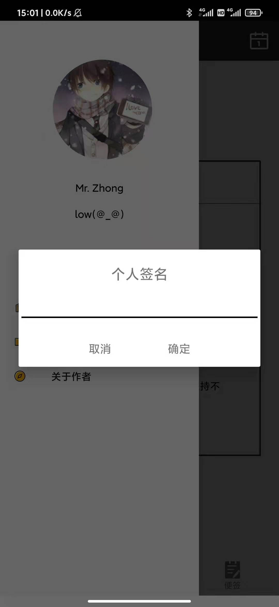
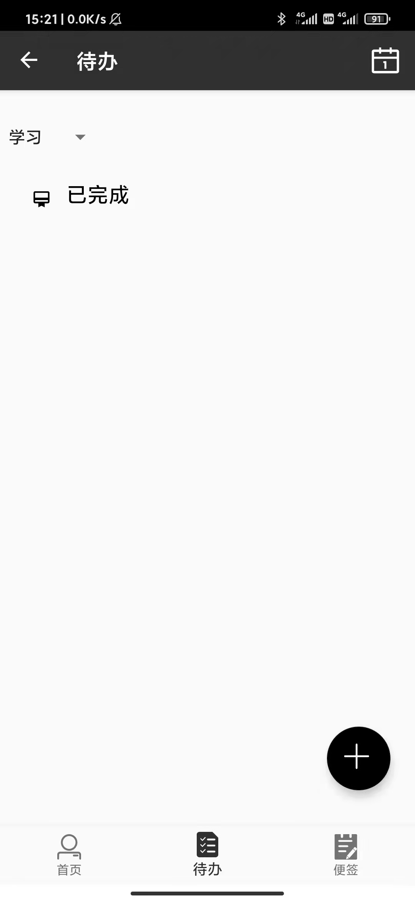
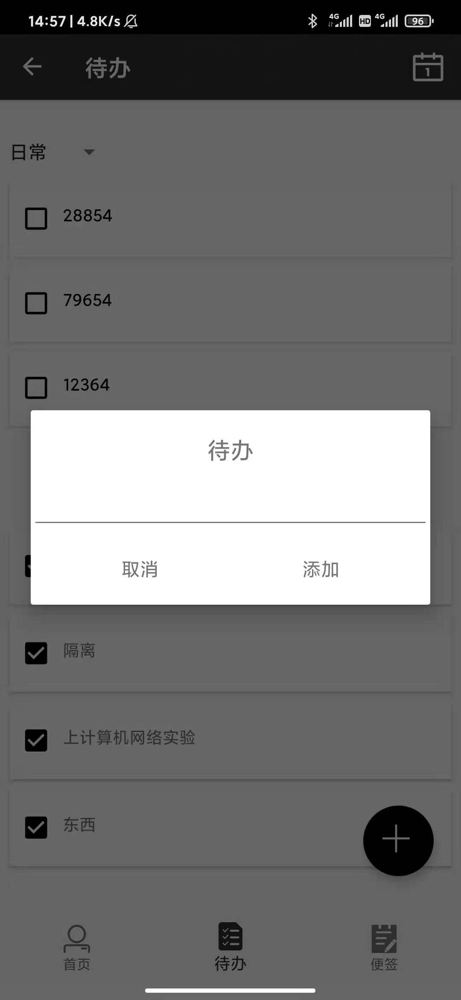

## 一、实验目的：

综合掌握Android的各部分内容和知识

## 二、实验要求：

运用Android的四大组件，以及Intent等机制，完成Android期末设计

## 三、实验过程：

### 1、项目介绍：

完成一个集合待办和便签以及日历显示待办的历史记录的随记APP。

软件的logo图为：

### 2、APP运行结果及分析

随记App启动时显示如下图，在启动页停留一秒后跳转至主界面。

主界面如下图所示，上面有一个Toolbar,左边有一个滑动菜单，底部有一个菜单，分别为首页、待办和便签。

在滑动菜单中，界面如下图二所示，可进行更改头像，昵称，个性签名。

滑动菜单中有计划本、便签簿及关于作者，截图如下图所示，计划本中，可添加(点击添加按钮)、删除(长按欲删除计划本触发)计划本，点击新建的学习计划本，显示如下图六，在便签簿中，也是这种原理。

在待办中，点击加号的按钮可进行添加待办，完成后点击待办前白色的方框，就会显示完成该待办。点击Toolbar中日历的logo, 就会显示当天完成待办的过程及时间，形成一个历史记录。

在便签中，界面如下图一所示，点击加号按钮，进入便签编写界面，如下图二所示，编写完成后悬浮按钮即可保存便签。长按便签可删除该便签。点击编辑可进行修改。

## 四、实验总结：

心得收获：通过上述实验，使我对一个安卓APP的建立的全过程有了更深刻的了解，这使我在安卓项目开发中有了一点经验。

