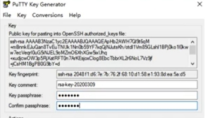

# 工具链的安装和运行helloword程序

## 一、工具链的安装

### 1、GitHub

SSH授权管理：

(1)、点击GitHub个人头像，进入Setting，并选择SSH和GPG keys:

 

 

(2)、点击New SSH key:

(3)、在Title位置填写一个合适的名称，然后打开SourceTree，点击工具，选择创建或导入SSH密钥：

(4)、点击Generate：

 

 

(5)、设置密码，然后点击Save private key,保存PPK文件

 

(6)、复制公钥，并粘贴到GitHub中：

 

 

 

### 2、SourceTree：

软件下载网址：https://www.sourcetreeapp.com/

下载好软件安装后。

连接到云端的GitHub：

1、 点击SourceTree右上角的设置：

2、 点击添加，并打开GitHub，选择克隆并复制SSH：

 

 

3、 将复制好的SSH粘贴到URL并点击确定：

### 3、MarkDown：

Typora软件下载地址：https://typora.io/

1、 下载并安装好Typora:

### 4、Git

Git软件下载地址：https://git-scm.com/downloads

下载并安装Git:

### 5、Android Studio

软件下载地址：https://developer.android.google.cn/studio?hl=zh-cn

安装的过程如下图的顺序。

 

 

 

 

 

 

 

 

 

 

 

 

 

 

 

 

 

 

 

 

 

## 二、运行helloworld程序

创建一个helloworld的项目，运行程序如下图所示。

 

 

 

 

