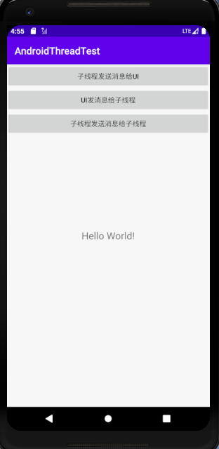
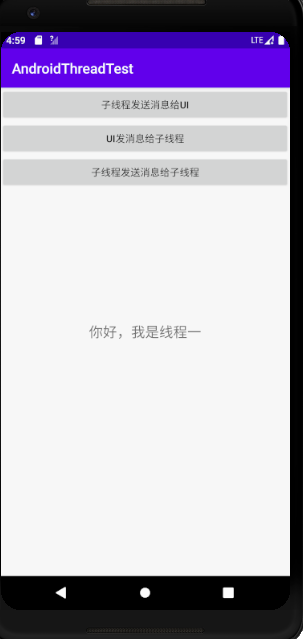
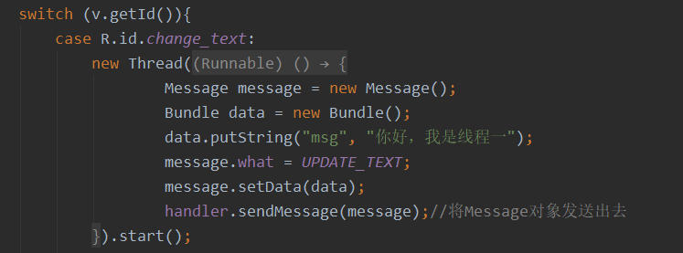
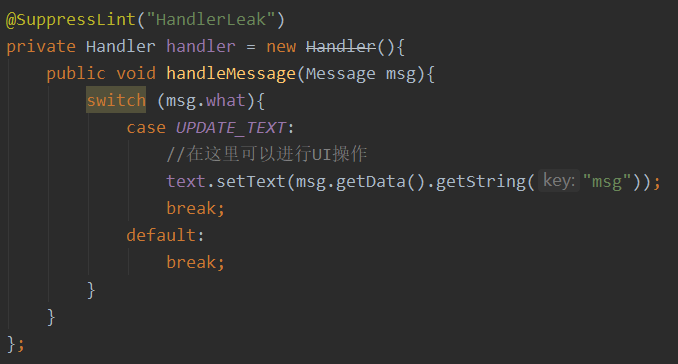
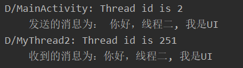
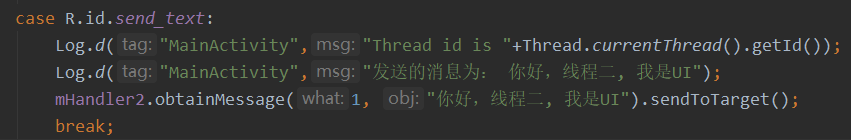
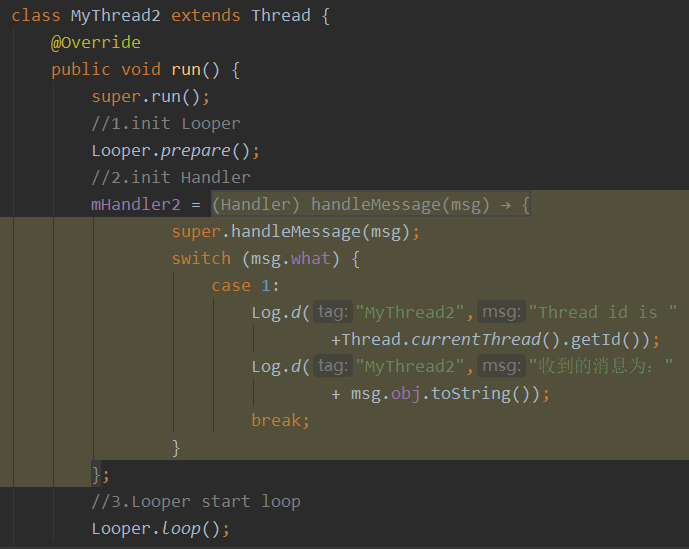
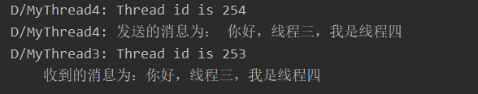
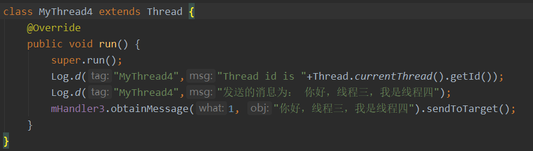
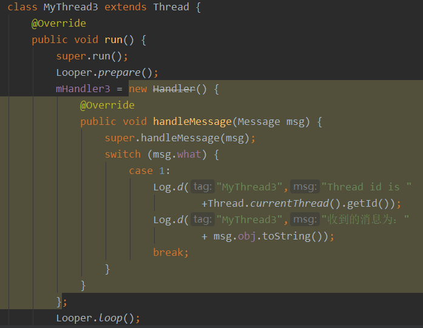

## 一、实验要求

自己创建子线程的程序框架，消息处理机制和多线程之间的数据交换

## 二、实验目的

了解多线程的框架，消息的处理机制，以及多线程之间的数据交换

## 三、实验过程

### 1、子线程发送消息给UI

运行程序后，界面如下图一，点击程序的第一个按钮后，会在UI更新一个消息,这个消息是线程一发送给UI 的。

线程一发送消息如下图所示：

UI 接受线程一的消息如下图：

### 2、UI发送消息给子线程

点击程序的第二个按钮，查看程序打印的消息，如下图所示：

UI 发送消息的操作如下图，发送消息之前，要先开始运行线程二

线程二接受消息的操作如下图：

### 3、子线程发送消息给子线程

点击程序的的第三个按钮，运行的结果如下图：

线程四发送消息的程序如下图：

线程三接受消息的程序如下图：

## 四、实验感想

经过这次实验，我理解了异步消息的处理机制，多线程之间的数据交换，也明白了子线程的框架。