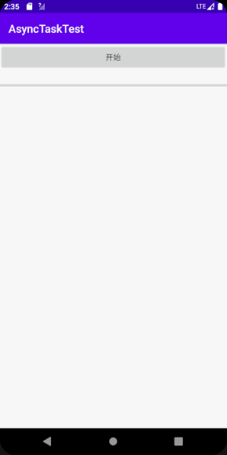
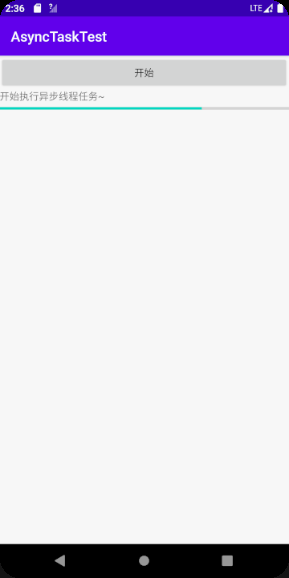
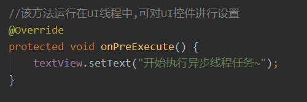
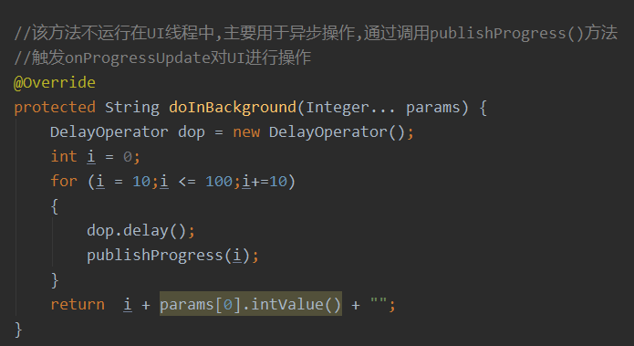
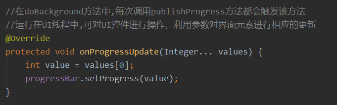

## 一、实验要求

异步任务的隐含子线程程序框架

## 二、实验目的

了解 AsyncTask 工具的使用方法，理解它的操作过程。

## 三、实验过程

### 1、程序运行展示

程序运行的界面如下图一所示，点击界面的按钮 ‘开始’ ，程序会开始进行一个异步任务，进行更新进度条的进度。

### 2、程序代码解析

这个方法在主线程执行，可对界面进行初始化操作，这边显示一个文字。

这个方法运行在子线程，用于异步操作，调用publishProgress()方法，触发onProgressUpdate()对UI进行操作。

这个方法可对UI界面元素进行更新，有publishProgress方法触发调用。

## 四、实验感想

经过这次实验，我理解的异步任务的子线程的程序框架。