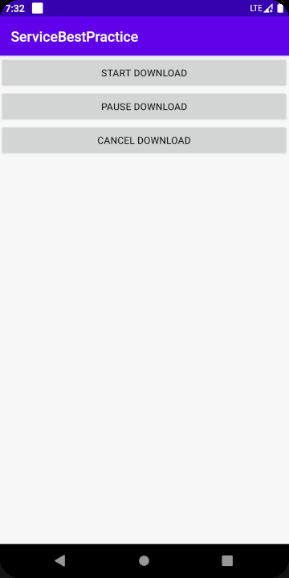
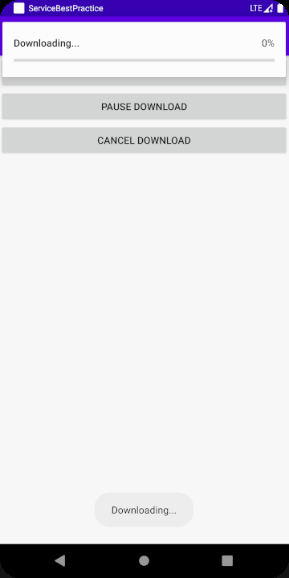
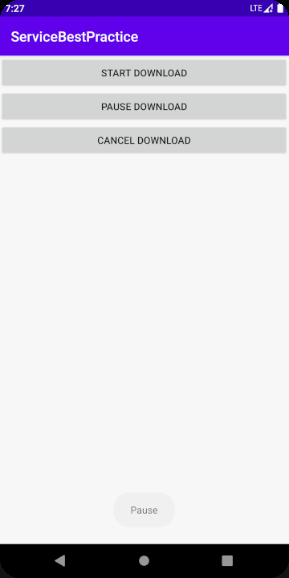
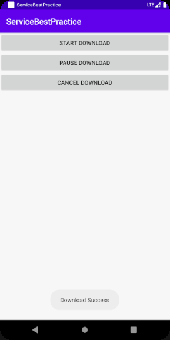
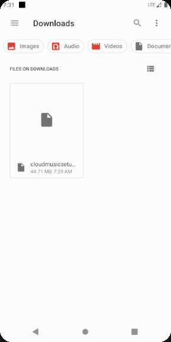
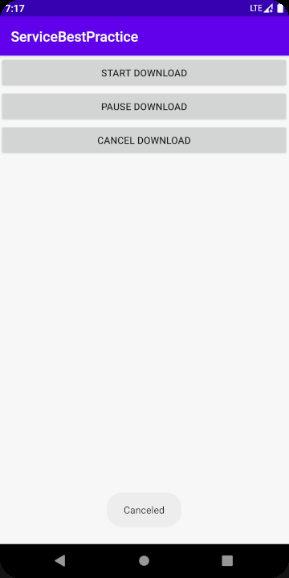

## 一、实验要求

子服务的绑定，子服务代码运行在异步任务

## 二、实验目的

了解子服务的绑定，子服务代码运行在异步任务

## 三、实验过程

### 1、程序运行结果

运行程序界面如图一所示，点击第一个按钮开始下载时，界面如图二所示，显示一个前台服务

点击第二个按钮，会暂停下载，界面显示一个提示

当下载成功后，会弹出一个下载成功的提示。

去SD卡中的Dowload目录，可以看到文件已经存在了，说明下载成功。

下载过程中，可以清除下载。关闭通知，清除下载文件

## 四、实验感想

经过这次实验了解了子服务的绑定，子服务代码运行在异步任务。