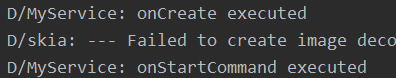
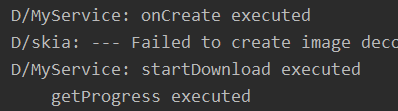
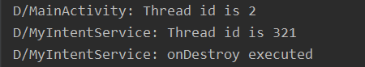

## 一、实验要求

启动和停止服务，服务代码运行在显示子线程。

## 二、实验目的

熟练掌握服务的启动和停止过程，多个线程之间如何通讯。

## 三、实验过程

### 1、程序运行展示

程序运行后的界面如下图所示。

点击按钮一开启服务，程序会打印如下图所示的消息：

点击按钮二时，停止服务，程序会打印如下图所示消息：

点击按钮三，界面会弹出一个通知，使用的是前台通知，让活动和服务进行通信。

程序运行后的打印日志如下图所示：

点击按钮四，解除活动和服务之间的绑定，打印日志如下图所示：

点击按钮五，打印日志如下图：使用了IntentService ,运行完毕后自动停止服务

## 四、实验感想

经过这次实验，我理解了服务的处理过程，函数调用的先后顺序。活动和服务之间的数据传递。