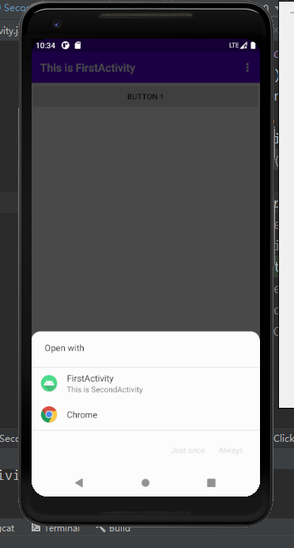
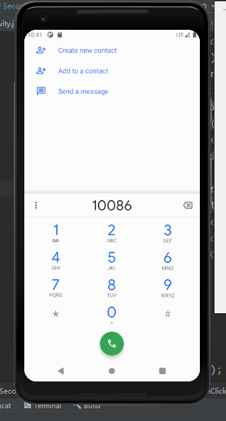
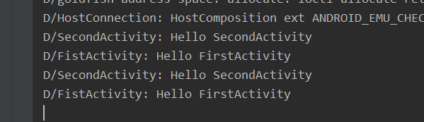

## Intent的应用

### 一、实验要求：Intent的应用，了解系统内置Intent和自定义的Intent的使用

### 二、实验过程

运行程序后，点击按钮，弹出选择浏览器，选择浏览器后，进入系统浏览器界面。这是响应http协议的Intent.

下面的截图的是调用系统拨号的界面。

下面是使用Intent 在启动活动的使用进行传递数据，可以向下一个活动传递数据，也可以返回数据给上一个活动。

### 三、实验感想：经过这次实验，理解了Intent 的使用方法，还有Intent 的作用。