## **实验三：活动的四种启动模式**

### **一、实验要求：**

**尝试活动的四种模式。**

### **二、实验目的 ：**

**了解活动的四种模式。**

### **三、实验过程**

***\*3.1、Standard 启动模式：\****

点击按钮一，会重新出现主窗口，如下图所示

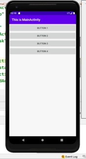 

多次点击按钮后，logcat中打印如下图：

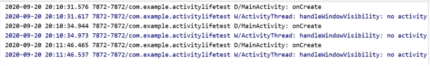 

 

**3.2、sigleTop 启动模式**

在主窗口中点击按钮二，手机显示如下图一，再点击图一的按钮时会显示图二。点击图二按钮时会显示图一，如此重复。

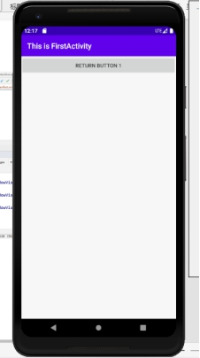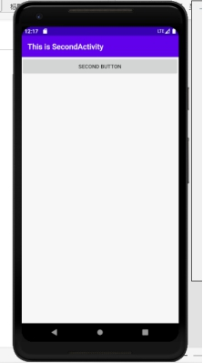 

多次点击后logcat中打印的信息如下：

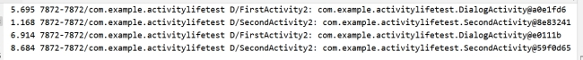 

 

**3.3、singleTask 启动模式**

在主窗口中点击按钮三，进入下图一的界面，再点击图一的按钮就会显示图二，点击图二的按钮三后显示图三，实际上图一和图二是同一个进程来的。

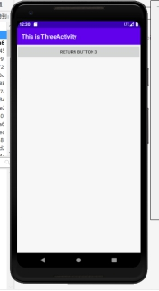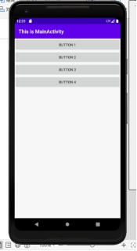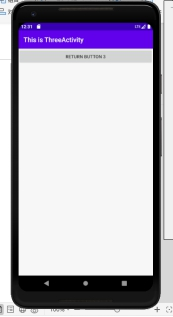 

点击后的lagcat中打印的信息如下：

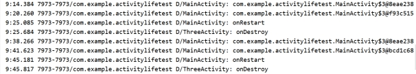 

 

**3.4、singleInstance启动模式**

在主界面中点击窗口按钮四，显示的界面如下图一，点击图一的按钮会显示图二界面，在图二界面中点击返回键，显示图三界面，图三界面中再点击返回键，会显示图四界面。

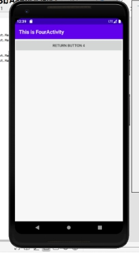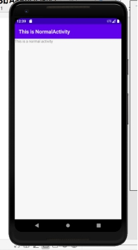 

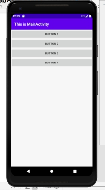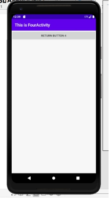 

一个启动模式完成后，logcat 中打印的信息如下：

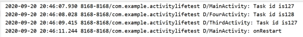 

### 四、实验感想

经过实验的过程，了解了活动的四种启动模式的启动模式，也从中联想到了一些自己使用手机时的操作，很多操作都与这四种启动模式重合。

