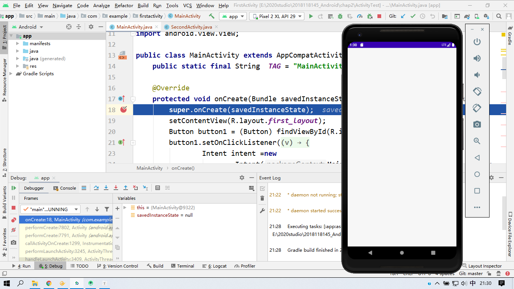
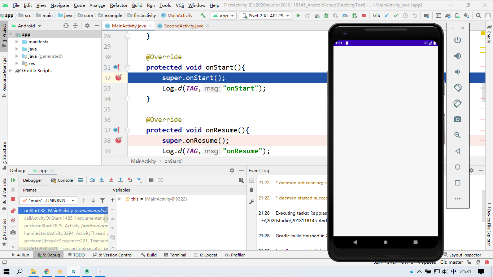
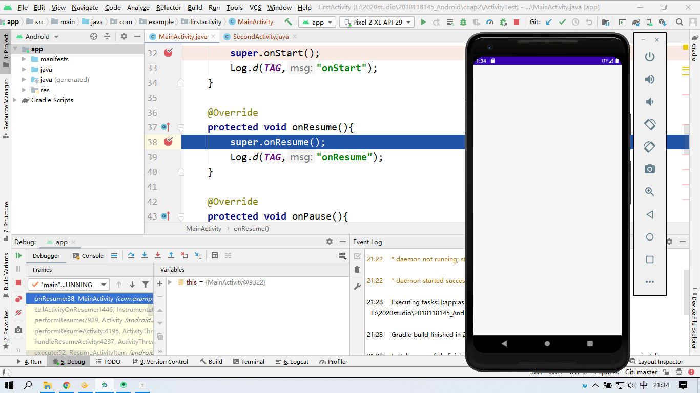
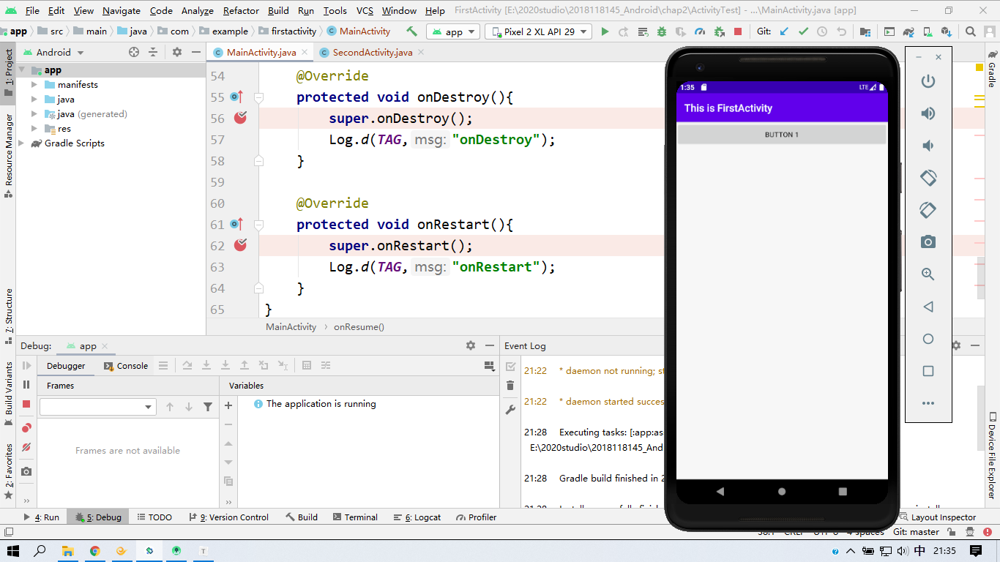
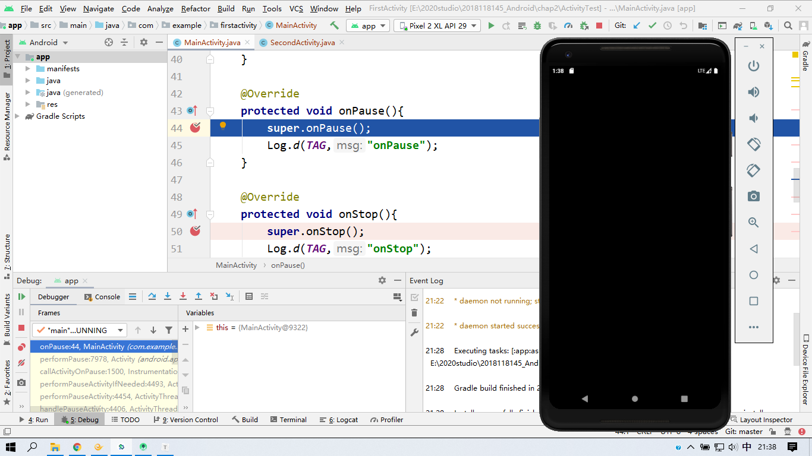
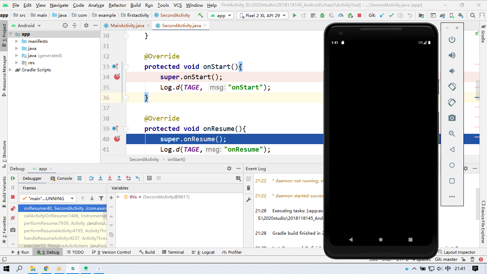
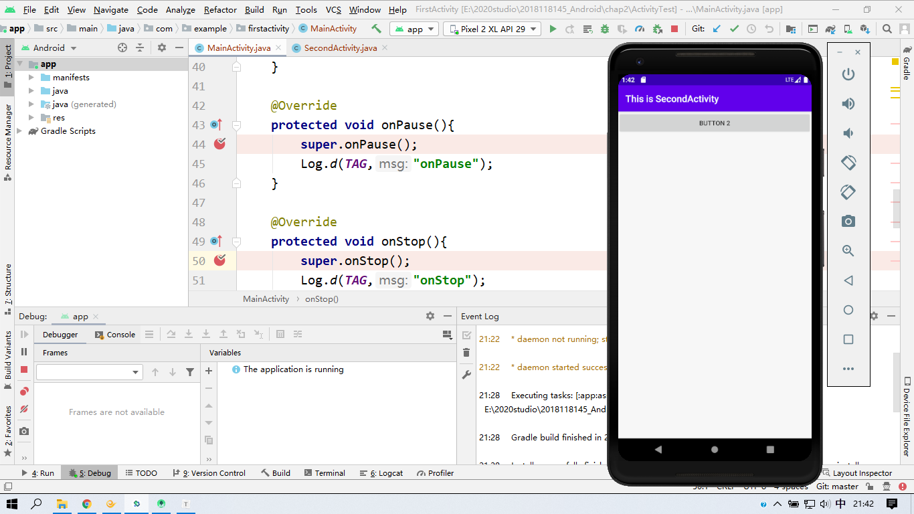

### 一、实验要求：

创建两个活动进行切换。对程序进行调试

### 二、实验目得：

了解活动的创建、销毁等过程，了解android 的活动内部的机制。

### 三、实验内容：

Debug 时，创建活动一时顺序为：onCreate()  --> onStart() -->onResume() -->显示活动一。

当点击活动一的按钮时，活动一切换到活动二，活动的顺序为：活动一onPause() ---> 活动二onCreate() --> 活动二onStart() --> 活动二onResume() --> 活动一onStop() -->显示活动二

### 四、实验感想

了解了活动的创建及其销毁的中间过程及步骤。活动与活动切换时，两个活动之间的关系。