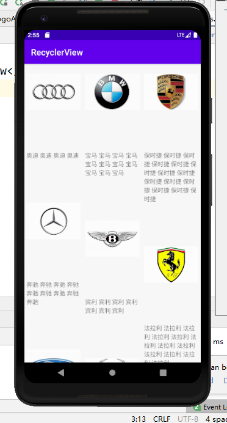
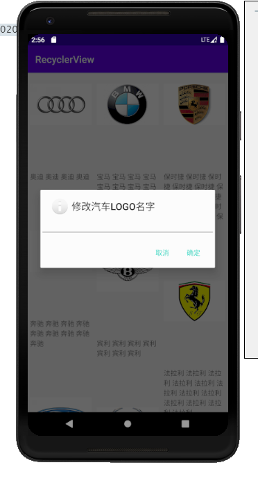
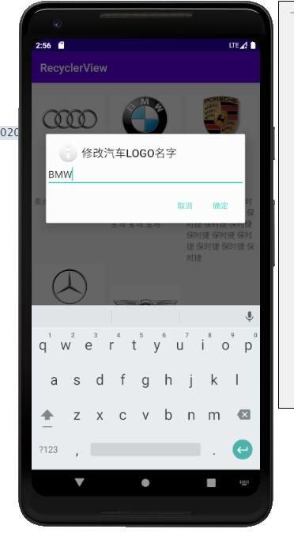
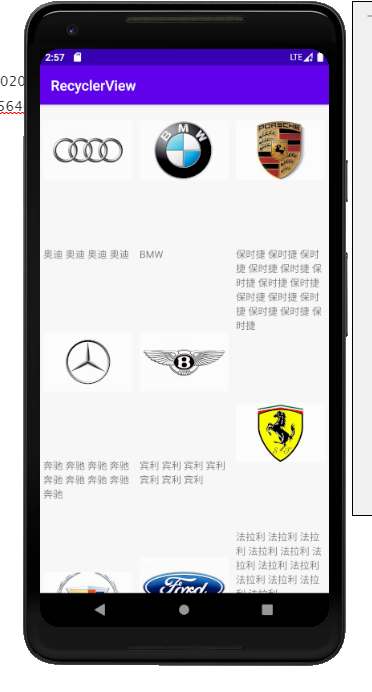

### 实验要求：

将RecyclerView 控件项目跑一遍。可以自己设置显示的内容，可以尝试点击控件后修改文字。

### 实验目的：

了解 RecylcerView 的使用方法

### 实验过程：

运行程序后显示如下图：

当点击宝马的名字时，会弹出一个对话框。

在对话框修改成BMW ,点击确定后。

可以看到宝马图标下面的名字已经修改成BMW 了。

### 实验总结：

经过这次实验，了解了RecyclerView 控件的使用，了解了弹窗的设计，了解了事件的调用方式，了解了事件的响应。

