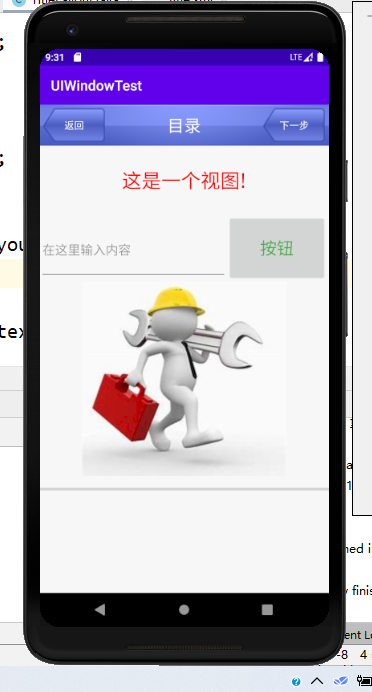
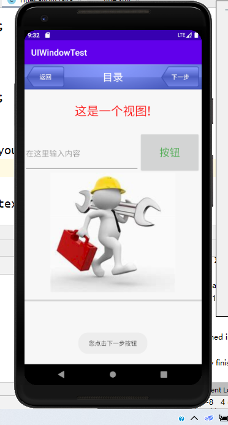
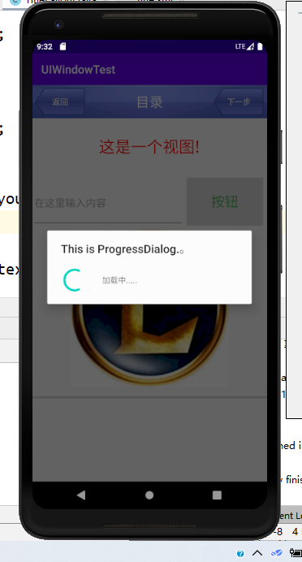
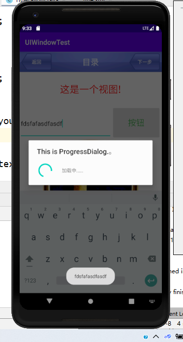

### 自定制UI界面

### 一、实验要求：

自己定制一个UI 界面

### 二、实验目的：

了解UI界面的制作过程

### 三、实验过程

运行时UI的界面如下：

点击下一步时，显示出一个提示窗口。

点击按钮时，会使换一张图片，同时显示一个加载提示框。当点击返回键时，窗口会退出。

在输入框中输入字符后，再点击按钮，会显示一个提示框提示出输入的字符。

### 四、实验收获

经过这次实验，了解了android 制作UI的过程，了解了android 界面的布局。