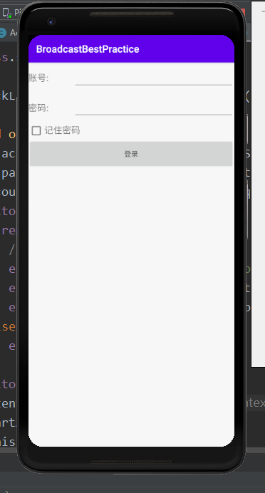
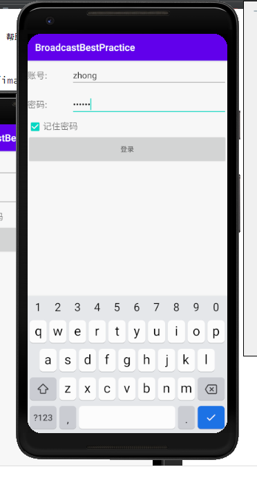
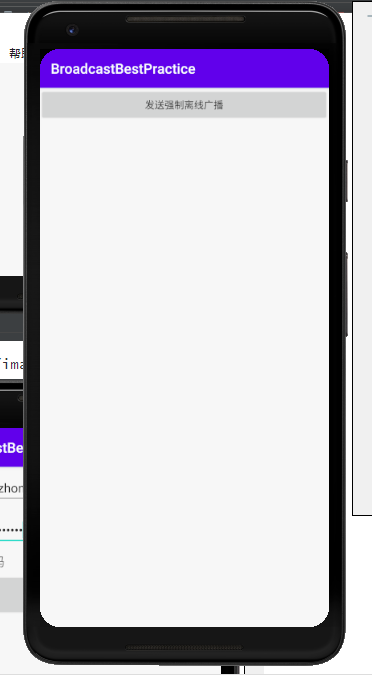
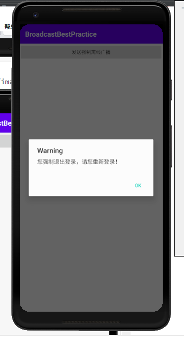
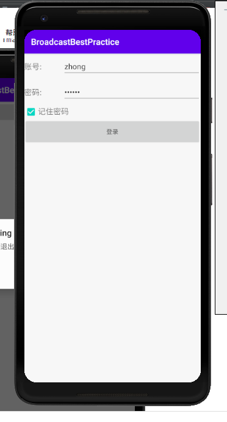

## 自定义广播

### 实验目的：了解广播的内容

### 实验过程：

运行程序后，出现填写账号密码，填写账号密码后，点击记住密码后，点击登录。

登录后会弹出一个窗口，有一个 “发送强制下线的广播’按钮”，点击后会弹出一个对话框，点击对话框中的 “OK” 按钮，就会强制下线，返回到登录界面

### 实验感想：经过这次实验，了解了广播的机制，明白了Adroid中的一些操作过程。